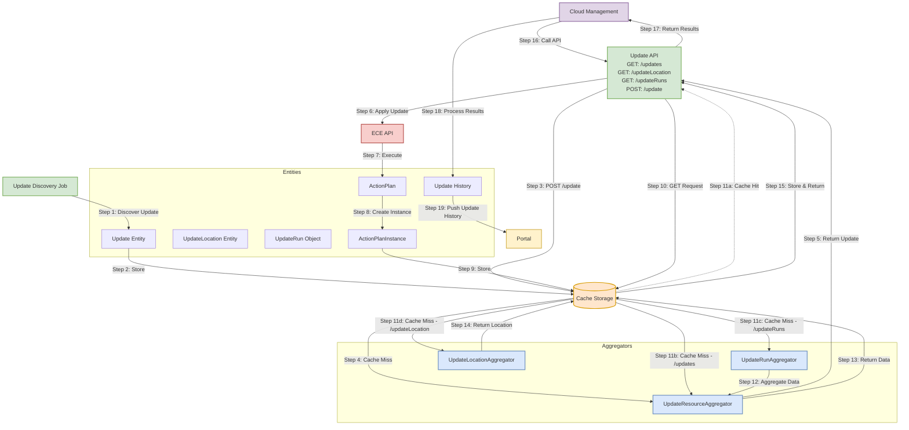
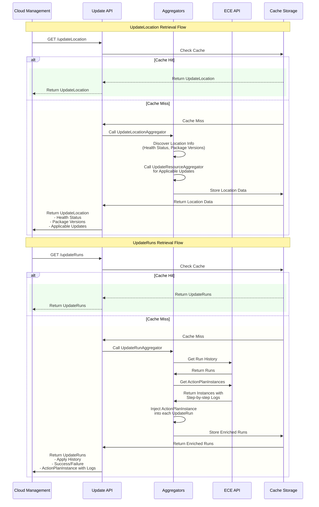
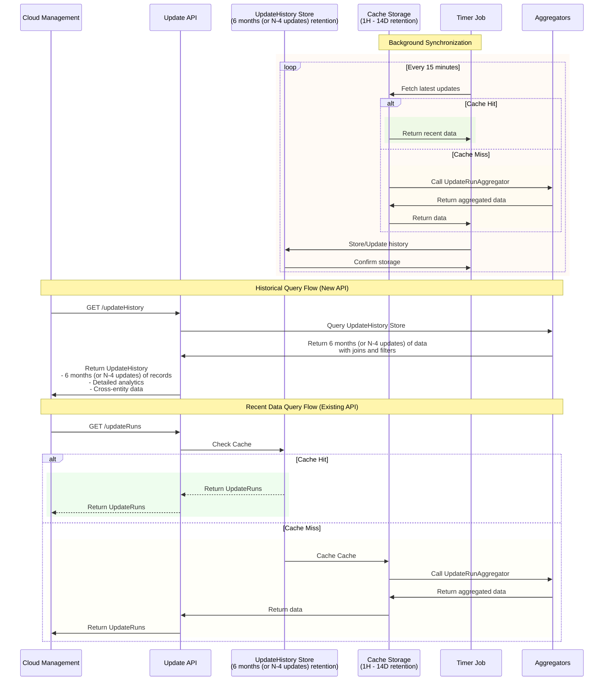
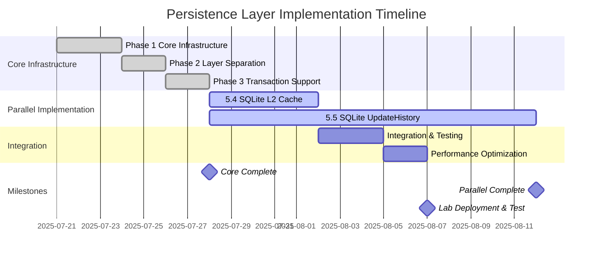
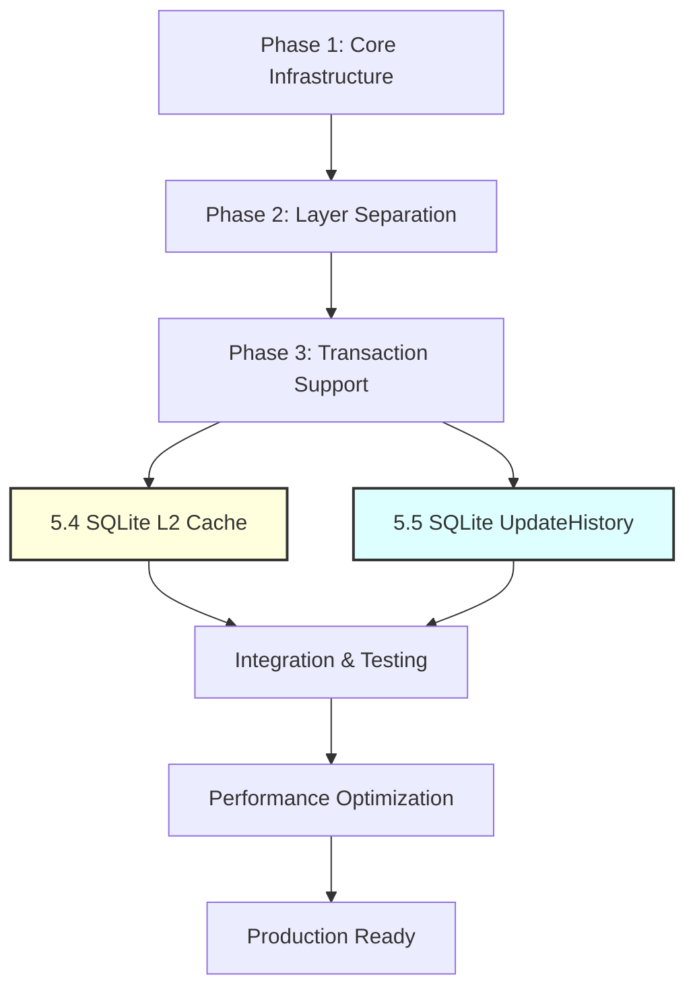
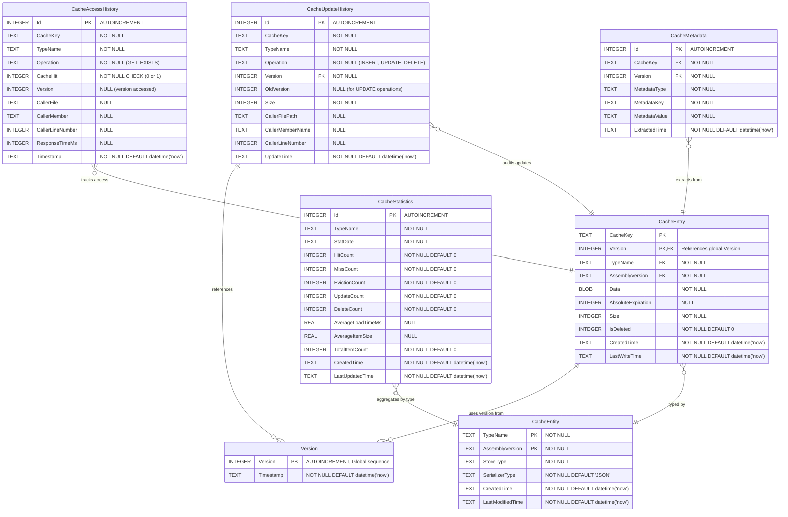
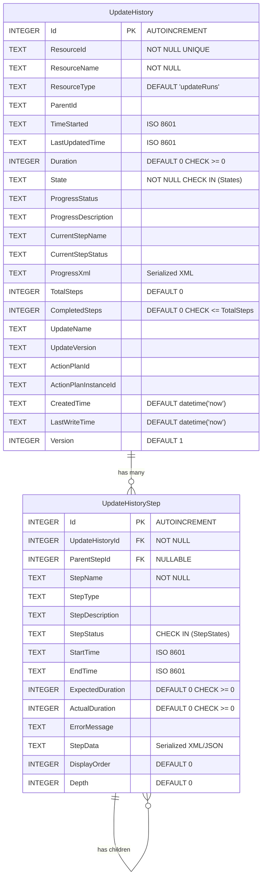

# Persistence Layer Design

## 1. Overview

The persistence layer provides a generic, type-safe data access abstraction for the Update Service, enabling consistent storage and retrieval of domain entities with built-in versioning, concurrency control, and audit capabilities. The layer is designed to operate in a Windows Server Failover Cluster environment with storage placed in Cluster Shared Volumes (CSV).

### 1.1 Update Lifecycle Flow

The following diagram illustrates how updates are discovered, stored, and applied through the system:



**Key Components:**
- **Update Discovery Job**: Scheduled job that discovers available updates from various sources
- **ECE API**: Enterprise Cloud Engine API that executes ActionPlans for updates
- **Update API**: RESTful API with endpoints:
  - `GET /updates`: Retrieve available updates (cache-first, fallback to UpdateResourceAggregator)
  - `GET /updateLocation`: Get update location information (cache-first, fallback to UpdateLocationAggregator)
  - `GET /updateRuns`: Get update run history (cache-first, fallback to UpdateRunAggregator)
  - `POST /update`: Apply an update (triggers ECE execution)
- **Aggregators** (grouped components under `..\src\UpdateResourceProvider\UpdateService\Core\Source`):
  - **UpdateRunAggregator**: Aggregates update run information from multiple sources
  - **UpdateResourceAggregator**: Manages update resource data and relationships
  - **UpdateLocationAggregator**: Manages update location data and status
- **Entities** (model objects under `..\src\UpdateResourceProvider\UpdateService\Models\Core\`):
  - **Update**: Represents an available update package
  - **UpdateLocation**: Represents update status at a specific location
  - **UpdateRun**: Represents an update execution instance
  - **ActionPlan/ActionPlanInstance**: ECE execution [plans](..\src\EceClient\Models\ActionPlanInstanceDescription.cs) and their [instances](..\src\EceClient\Models\ActionPlanInstance.cs)
  - **UpdateHistory**: Historical update data for portal display
- **Cache Storage**: Persistent storage layer with cache-first access pattern for all entities
- **Cloud Management**: External service that polls Update API for update runs and processes results
- **Portal**: Azure portal that displays update history and status to end users

### 1.2 Update History Flow

The following sequence diagram illustrates how Cloud Management retrieves update history and location information:



**Key Flow Details:**

1. **UpdateLocation Retrieval**:
   - Cloud Management requests location information via `GET /updateLocation`
   - Update API checks cache first (cache-first pattern)
   - On cache miss, UpdateLocationAggregator discovers:
     - Current health check status
     - Installed package versions
     - Applicable updates (via UpdateResourceAggregator)
   - Results are cached before returning to Cloud Management

2. **UpdateRuns Retrieval**:
   - Cloud Management requests run history via `GET /updateRuns`
   - Update API checks cache first
   - On cache miss, UpdateRunAggregator:
     - Fetches run history from ECE API
     - Retrieves ActionPlanInstances with detailed step-by-step logs
     - Injects ActionPlanInstance into each UpdateRun
   - Enriched results are cached before returning

3. **Data Enrichment**:
   - UpdateRuns are enriched with ActionPlanInstances containing:
     - Detailed execution logs for each step
     - Success/failure status
     - Timing information
     - Error details (if any)

### 1.3 New Update History Flow (Future Implementation)

The following sequence diagram illustrates the enhanced update history flow with long-term retention:



**Key Design Changes:**

1. **Dual Storage Architecture** since they serve different purposes:
   - **Cache Storage**: transaction data store
     - Key-Value Store (KVS) with JSON serialization
     - 1h-14d expiration policy
     - Fast retrieval by key
     - Lited query capabilities
   - **UpdateHistory Store**: report data store
     - Fully relational database with normalized schema
     - 6-month retention period
     - Expanded entity fields with proper columns
     - Rich query support with joins and indexes
     - Optimized for complex analytical queries

2. **Timer Job Synchronization**:
   - calls update API via UpdateServiceClient, which is created by failover service resolver.
   - Runs every 15 minutes (configurable)
   - Fetches latest data from Cache Storage (KVS)
   - Transforms JSON data to relational format
   - Persists to UpdateHistory Store tables
   - Maintains referential integrity and indexes

3. **API Endpoints and Routing**:
   - **GET /updateRuns**: 
     - Returns recent update runs (≤1h-14d)
     - Uses Cache Storage for fast retrieval
     - Simple key-based lookups
   - **GET /updateHistory**: 
     - Returns historical data (up to 6 months (or N-4 updates))
     - Uses UpdateHistory Store exclusively
     - Supports complex queries with filters and joins
     - Enables analytical queries across entities

4. **Storage Comparison**:
   | Aspect | Cache Storage | UpdateHistory Store |
   |--------|--------------|-------------------|
   | Type | Key-Value Store | Relational Database |
   | Format | JSON blobs | Normalized tables |
   | Query | By key only | SQL with joins |
   | Indexes | Primary key | Multiple indexes |
   | Retention | 1H - 14D | 6 months (or N-4 updates) |
   | Use Case | Fast retrieval | Analytics & reporting |

5. **Benefits**:
   - Optimized storage for different access patterns
   - Rich query capabilities for historical analysis
   - Efficient resource utilization
   - Support for complex reporting requirements

### 1.4 Goals

- Provide a simple, generic and type-safe persistence layer for the Update Service
- Build L2 cache on top of persistence layer

### 1.5 Non-Goals

- not cross-platform, service targeting net472 on windows
- no distributed transaction coordinator, backend storage is locked by single process
- archive/backup feature is out-of-scope
- no encryption

## 2. Functional Requirements

### 2.1 Core Capabilities
- **Generic Entity Storage**: Support for any entity type with configurable keys and indexes
  - for DB backend:
    - Table schema generation based on property attributes
    - Supports single and composite primary keys
    - Supports unique constraints and non-clustered indexes
    - Supports foreign key relationships between entities
  - for File backend:
    - key-value storage with JSON serialization, any entities without default constructor, use custom `JsonConverter`
    - Key is arranged as two parts: `EntityTypeName/EntityId`, entity id is either a field or queryHash.
    - Value is serialized JSON representation of the entity, plus additional metadata: CreationTime, LastWriteTime, Version, and ExpirationTime (if applicable)
    - metadata is stored in memory for fast access, as well as stored per entity type in a separate file. Metadata is persisted to disk both by interval (asynchronously) and on shutdown (synchronously). It contains:
      - EntityTypeName
      - PrimaryKeyFieldName
      - Size
      - Tags (for query purpose)
      - AdditionalParameters (KVPs used to get entity id/queryHash)
      - TrackingFields (CreateTime, LastWriteTime, Version)
- **CRUD Operations**: Create, Read, Update, Delete operations for each entity type
  - supports both single entity operations and list operations
  - supports optimistic concurrency control using versioning
  - supports soft delete (marking entities as deleted without physical removal)
  - supports bulk operations with configurable batch sizes (for speed, there is no locking/transaction)
  - all methods are asynchronous, wraps sync methods if async is not available in the underlying storage (such as SQLite transaction operations)
  - supports both commit and rollback, that takes list of Action<T> as argument.
- **Query Support**: Expression-based queries that can be translated to underlying storage queries
- **Versioning**: Automatic version tracking for optimistic concurrency control
- **Audit Trail**: Built-in creation and modification timestamps for all entities
- **Index Management**: Declarative index configuration per entity type
- **Transaction Support**: Ordered list of operations that can be committed or rolled back
- **Retention Policies**: Configurable entity expiration and cleanup/archive operations
- **Update History Management**: Long-term storage and retrieval of update run history
  - Separate relational database for minimum of 6-month retention
  - Normalized schema based on UpdateRunClient entity
  - Rich query capabilities with filters, joins, and aggregations
  - Background synchronization from cache to history store
  - Dedicated API endpoint (/updateHistory) for historical queries

### 2.2 Query Features
- Predicate-based filtering using LINQ expressions
- Pagination support with configurable page sizes
- Sorting by any entity field
- Projection support for selecting specific fields
- Aggregation capabilities (count, sum, average)

## 3. Non-Functional Requirements

### 3.1 Performance
- Based on benchmark analysis, we should be able to achieve: single entity CRUD operations: < 20ms for small payload (<1KB), 100ms for medium payload (1KB-100KB), and 2s for large payload (1-20MB)
- Batch operations: ~100 operations per second
- Query response time < 500ms for result sets up to 1000 records
- CSV access optimization for cluster shared storage

### 3.2 Scalability
- Efficient handling of large entity payloads (1-20MB per entity)
- Multi-node concurrent access to CSV storage is NOT supported.
- Configurable caching layer for frequently accessed data
- Asynchronous operation support throughout

### 3.3 Reliability
- Failover cluster aware with automatic node failover support
- Data integrity validation at persistence boundaries

### 3.4 Security
- Parameter sanitization to prevent injection attacks
- Field-level encryption support for sensitive data
- Audit logging of all data modifications
- Windows integrated authentication and ACL support

## 4. Conceptual Design

### 4.1 Entity Model
Every persistable entity must define:
- **Primary Key**: Single or composite key for unique identification
- **Indexed Fields**: Fields requiring query optimization
- **Tracking Fields**: System-managed fields (CreateTime, LastWriteTime, Version)

### 4.2 Repository Pattern
Generic repository interface providing:
- Type-safe operations based on entity type
- Expression-based query capabilities
- Automatic tracking field management
- Concurrency conflict detection

### 4.3 Storage Architecture
- **Primary Storage**: File storage on Cluster Shared Volumes
- **Failover Support**: Automatic reconnection on node failover is managed by service.
- **Regular Backups**: Scheduled backups of CSV storage to recover from data loss (out-of-scope but planned)
- **Data Integrity**: Validation using checksums or hashes for large payloads (out-of-scope but planned)

## 5. Implementation Plan

### Implementation Timeline

The following timeline shows how sections 5.4 (SQLite L2 Cache) and 5.5 (SQLite UpdateHistory) can be implemented in parallel:



#### Parallel Implementation Benefits

1. **Resource Utilization**: Two teams can work independently on cache and history implementations
2. **Shared Components**: Both implementations use common SQLite infrastructure from Phase 1-3
3. **Risk Mitigation**: Issues in one implementation don't block the other
4. **Faster Delivery**: Total implementation time reduced from 10 days sequential to 5 days parallel

#### Implementation Dependencies



### 5.1 Phase 1: Core Infrastructure (Days 1-3)
- Define base interfaces and contracts
- Implement tracking field management
- Create generic repository base class
- Cluster-aware service initialization: retry + init file (indicating which service obtained the lock).

**Deliverables**: Core contracts, base implementations, unit tests

See [Appendix C: Core Persistence Contracts](persistence_appendix_c_core_contracts.md) for the C# interface definitions.

### 5.2 Phase 2: SQLite Persistence Provider (Days 4-6)
- SQLite schema generation based on entity attributes
- SQLite config with hot reload support via API
- Unit tests for SQLite operations, covering CRUD, batch, bulk, and transactional operations

**Deliverables**: SQLite storage provider, failover tests

See [Appendix D: Transaction Management](persistence_appendix_d_transaction_management.md) for the ITransactionScope and ITransactionalOperation implementations.

See [Appendix E: SQLitePersistenceProvider Implementation](persistence_appendix_e_implementation.md) for the C# implementation showing how CRUD operations are translated to SQL statements with parameters.

### 5.3 Phase 3: SQLite Query Capabilities (Days 7-8)
- Complex predicate support
- Pagination implementation
- Query optimization for SQLite-based storage
- Distributed query coordination

**Deliverables**: Enhanced query API, cluster query tests

### 5.4 Phase 4: SQLite as L2 Cache (Days 9-12)
- Implement distributed cache API on top of SQLite
- Refactor change detection to separate layer
- Refactor serialization to use JSON for all entity types
- Make L2 cache provider configurable via API, can switch between File and SQLite
- Implement data migration between different persistence layers
- Audit trail in SQLite (implemented as ETW logs in file cache)
- Stats report in SQLite
- Cache expiration with soft delete support
- Implement unit tests for SQLite cache provider
- Implement integration tests for SQLite cache provider

See [Appendix A: SQLite Cache Schema](persistence_appendix_a_sqlite_cache_schema.md) for the complete SQL schema definition, including [Section A.5](persistence_appendix_a_sqlite_cache_schema.md#a5-cacheentryt-storage-details) which details how `CacheEntry<T>` objects are stored in the CacheEntry table.



#### Schema Relationships and Version Management

- **Global Version Sequence**: The `Version` table maintains a global auto-incrementing sequence used across all cache operations
- **CacheEntry Versioning**: 
  - Each entry has a composite primary key (Key, Version) allowing multiple versions of the same key
  - Single table for multiple entity types, with TypeName column for filtering by type
  - When an entry is updated, a new version is created from the global sequence
  - The version acts as an ETag for optimistic concurrency control
  - Composite primary key (Key, Version) ensures unique versioning per cache key
  - Updates are blocked if the provided version doesn't match the latest version in the table
- **Generic CacheEntry<T> Storage**:
  - The generic `CacheEntry<T>` wrapper (documented in [Appendix C](persistence_appendix_c_core_contracts.md#c3-cache-entry-wrapper)) is stored in the CacheEntry table
  - The `Data` column stores the serialized `CacheEntry<T>` object as a byte array (BLOB)
  - The serialization includes the wrapped value of type T, metadata, and expiration settings
  - The `TypeName` column stores the actual type name of T (e.g., "UpdateEntity", "UpdateRun")
  - The `AssemblyVersion` column tracks the assembly version for type evolution support
- **Audit Trails**:
  - `CacheUpdateHistory` tracks all write operations (INSERT, UPDATE, DELETE) with version tracking
  - `CacheAccessHistory` tracks all read operations for performance monitoring and audit
  - Both tables reference the global version sequence for consistency
  - `AccessHistory` tracks all read operations for performance monitoring and audit
  - `CacheStatistics` aggregates daily performance metrics by TypeName for monitoring and capacity planning
- **Optimistic Concurrency Control**:
  - Clients must provide the current version when updating an entry
  - If the version doesn't match the latest in the database, the update is rejected
  - This prevents lost updates in concurrent scenarios
- **Metadata**:
  - extracts searchable tags from cached entities based on their type for advanced querying (this can be discovered update manifest, or update itself)
  - stores current snapshot for each entity type and cachekey
  - do not store deleted entities, only current version
  - when cache key is a hash from query parameters, such as resover context, json is stored as a separate field in the metadata table
- **EntityType**:
  - `CacheEntity` table stores metadata about each entity type, its serialization type and store type associated with deployed version.
  - Used for data migration and schema evolution (note: the logic can be complex and should move to separate design doc)

#### Metadata Extraction Patterns

The `CacheMetadata` table enables powerful search capabilities by extracting type-specific tags from cached entities:

**Update Entity Metadata:**
- MetadataType: "Update"
- Tags:
  - `PackageType`: (e.g., "Solution")
  - `Version`: (e.g., "1.2504.1.1")
  - `PackageArtifact`: (e.g., "Solution1.2504.1.1.zip")
  - `Dependencies`: (e.g., "Service.1.2411")
  - `Publisher`: (e.g., "Microsoft Corporation")
  - `ReleaseDate`: (e.g., "2024-03-15")

**UpdateRun Entity Metadata:**
- MetadataType: "UpdateRun"
- Tags:
  - `ActionPlanId`: (e.g., "AP-12345678-90ab-cdef")
  - `Status`: (e.g., "InProgress", "Completed", "Failed")
  - `StartTime`: (e.g., "2024-03-20T10:00:00Z")
  - `UpdateVersion`: (e.g., "Solution1.2504.1.1")

**UpdateLocation Entity Metadata:**
- MetadataType: "UpdateLocation"
- Tags:
  - `LocationName`: (e.g., "redmond")
  - `CurrentVersion`: (e.g., "12.2508.1001.5180")
  - `PackageVersion`: (e.g., "Solution=12.2508.1001.5180, Services=99.9999.9.11, SBE=4.0.0.0")
  - `HealthStatus`: (e.g., "Success", "Warning", "Critical")
  - `LastHealthCheck`: (e.g., "2024-03-20T09:30:00Z")
  - `ApplicableVersions`: (e.g., "2.1.2403.0;2.1.2404.0")
  - `State`: (e.g., "AppliedSuccessfully")

#### Version-Based Concurrency Control

The persistence layer uses entity versions as ETags for optimistic concurrency control:

**CREATE Operation**:
1. First checks if an entity with the same key already exists
2. If found and `IsDeleted = false`, throws `EntityAlreadyExistsException`
3. If not found or `IsDeleted = true`, creates new entity with new version from global sequence
4. This prevents accidental overwrites of existing data

**UPDATE Operation**:
1. Client must provide the entity with its current version
2. Update SQL includes `WHERE Version = @originalVersion AND IsDeleted = 0`
3. If no rows affected (version mismatch or entity deleted), throws `ConcurrencyException`
4. On success, entity gets new version from global sequence
5. This prevents lost updates in concurrent scenarios

**Example Scenario**:
```
Client A reads entity (Version=5)
Client B reads entity (Version=5)
Client A updates entity (Version→6)
Client B attempts update with Version=5 → ConcurrencyException
```

This ensures data consistency without requiring pessimistic locking, allowing better scalability in multi-node environments.

**Deliverables**: L2 cache provider with SQLite, plus unit and integration tests

### 5.5 Phase 5: Update History Store (Days 9-30)

> note: detailed design and implementation for this feature is in separate doc.

- Design and implement UpdateHistory SQLite schema
- Implement UpdateServiceClient, UpdateServiceClientFactory and use service resolver to find endpoint
- Create UpdateHistory API endpoint (/updateHistory)
- Implement timer job for cache-to-history synchronization
- Support recursive Step structure with children Steps[]
- Add blob type support for serialized step data
- Integration with existing Update API

See [Appendix B: UpdateHistory SQLite Schema](persistence_appendix_b_updatehistory_schema.md) for the complete SQL schema definition.

#### Update History ER Diagram:



#### Schema Design Notes:

1. **UpdateHistory** (Main Table):
   - Primary entity storing update run information
   - Includes resource identification from BaseResourceProperties
   - Contains denormalized progress information for query performance
   - Indexed on ResourceId, TimeStarted, State, UpdateName, and ActionPlanId

2. **UpdateHistoryStep** (Detail Table):
   - Stores individual step execution details with recursive structure
   - Supports parent-child relationships via ParentStepId for nested steps
   - One-to-many relationship with UpdateHistory
   - Captures timing, status, and error information per step
   - Includes StepData blob field for serialized step information (XML/JSON)
   - Maintains DisplayOrder and Depth for hierarchical presentation


#### Step Model Implementation Notes:

The Step structure in UpdateRun (defined in `src\UpdateResourceProvider\UpdateService\Models\Step.cs`) is recursive, where each Step can contain child Steps[]. This hierarchical structure is preserved in the UpdateHistoryStep table through:

1. **ParentStepId**: Links child steps to their parent step
2. **Depth**: Indicates nesting level (0 for root steps, increments for each level)
3. **DisplayOrder**: Maintains the order of steps within the same parent
4. **StepData (BLOB)**: Stores serialized Step object as XML string, preserving:
   - Complete step configuration
   - Properties specific to step types
   - Any custom attributes or metadata

Example Step Hierarchy:
```
UpdateRun
├── Step 1: "Prepare Update" (Depth=0, DisplayOrder=1)
│   ├── Step 1.1: "Download Package" (Depth=1, DisplayOrder=1)
│   └── Step 1.2: "Validate Package" (Depth=1, DisplayOrder=2)
├── Step 2: "Apply Update" (Depth=0, DisplayOrder=2)
│   ├── Step 2.1: "Stop Services" (Depth=1, DisplayOrder=1)
│   ├── Step 2.2: "Install Components" (Depth=1, DisplayOrder=2)
│   │   ├── Step 2.2.1: "Install Component A" (Depth=2, DisplayOrder=1)
│   │   └── Step 2.2.2: "Install Component B" (Depth=2, DisplayOrder=2)
│   └── Step 2.3: "Start Services" (Depth=1, DisplayOrder=3)
└── Step 3: "Verify Update" (Depth=0, DisplayOrder=3)
```

**Deliverables**: UpdateHistory store implementation, timer job, new API endpoint, update client, unit tests and integration tests

### 5.6 Phase 6: Production Readiness (Days 13-20)
- PR merged to main, packages deployed to PreProd/Lab
- Performance tuning for CSV and UpdateHistory
- Monitoring and diagnostics
- Operations documentation
- Tweak configuration and determine best/default settings
- Test data migration

**Deliverables**: Production-ready system, deployment guide

## 6. Test Strategy

### 6.1 Unit Tests
- **Coverage Target**: 90%+ for core logic
- **Focus Areas**:
  - Entity tracking field updates
  - Query expression parsing
  - Concurrency version management
  - Large payload serialization

### 6.2 Integration Tests
- **CSV Access**: Multi-node concurrent access patterns
- **SQLite on CSV**: Database operations on shared storage
- **Failover Scenarios**: Node failure and recovery
- **Large Payload Handling**: 1-20MB entity persistence

### 6.3 End-to-End Tests
- **Cluster Deployment**: Full ClusterGroup deployment
- **Failover Testing**: Automatic failover and data consistency
- **Load Distribution**: Multi-node operation verification
- **CSV Performance**: Shared storage access patterns

### 6.4 Performance Tests
- **Benchmarks**:
  - Single entity CRUD (1-20MB): < 200ms
  - Batch operations: ~100/second
  - CSV concurrent access: Linear scaling to 4 nodes
  - Failover recovery time: < 30 seconds

### 6.5 Concurrency Tests
- **Concurrent Write**: Simultaneous Writes
- **Version Conflicts**: Dirty reads and lost updates

## 7. Success Criteria

1. **Cluster Compatibility**: Seamless operation in failover cluster environment
2. **Performance Targets**: Meeting benchmarks with CSV storage
3. **High Availability**: Automatic failover with data consistency
4. **CSV Optimization**: Efficient shared storage utilization
5. **Test Coverage**: Comprehensive cluster scenario testing

## 8. Risks and Mitigations

| Risk | Impact | Mitigation |
|------|---------|------------|
| CSV access contention | High | Intelligent caching, read replicas |
| SQLite file locking on CSV | High | Proper lock timeout configuration |
| Failover data consistency | High | Transaction log synchronization |
| Network latency to CSV | Medium | Local caching, async operations |

## 9. Dependencies

- Windows Server Failover Clustering
- Cluster Shared Volumes (CSV) infrastructure
- .NET Framework 4.7.2 with System.Data.SQLite
- Service Fabric cluster integration
- Windows Failover Cluster APIs

## Appendices

The persistence layer documentation has been organized into separate appendix files for better maintainability and readability:

- **[Appendix A: SQLite Cache Schema](persistence_appendix_a_sqlite_cache_schema.md)** - Database schema definitions for cache tables, audit tables, and indexes
- **[Appendix B: UpdateHistory SQLite Schema](persistence_appendix_b_updatehistory_schema.md)** - Schema for update history tracking and step hierarchy
- **[Appendix C: Core Persistence Contracts](persistence_appendix_c_core_contracts.md)** - Interface definitions for entities, repositories, persistence providers, and the generic CacheEntry<T> wrapper
- **[Appendix D: Transaction Management](persistence_appendix_d_transaction_management.md)** - Transaction scope implementation and forward/reverse operation patterns
- **[Appendix E: SQLitePersistenceProvider Implementation](persistence_appendix_e_implementation.md)** - Complete implementation details of CRUD operations and SQL translation
- **[Appendix F: Entity Examples](persistence_appendix_f_entity_examples.md)** - Example entity definitions using attribute-based mapping
